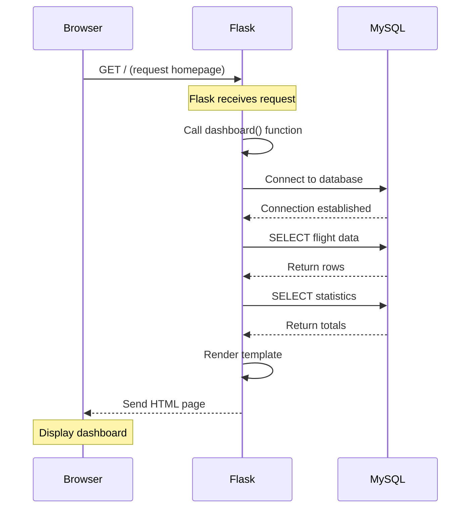
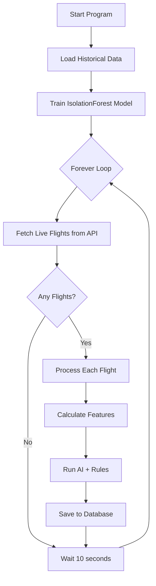
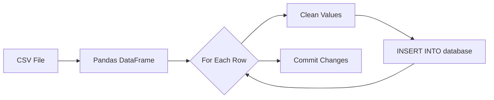
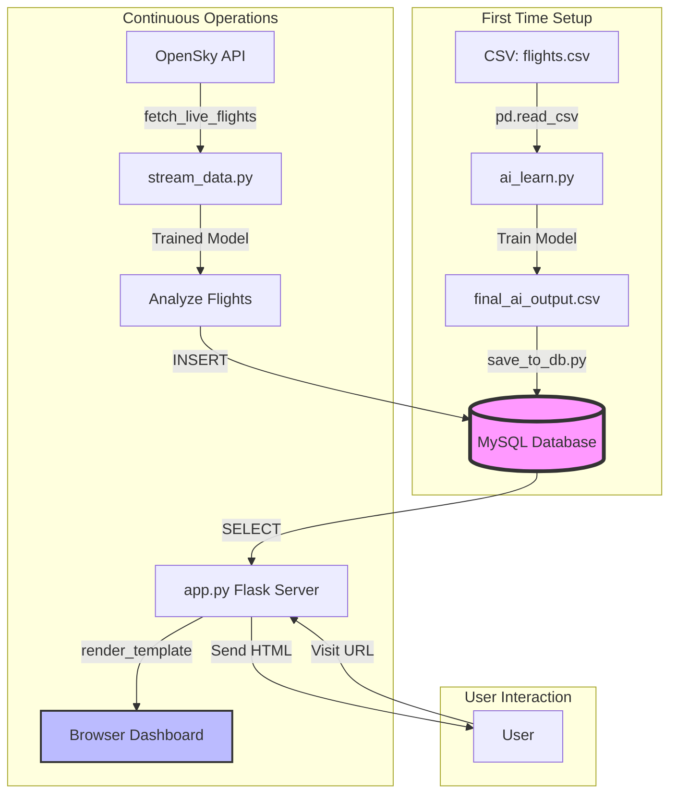

# Visual Project Walkthrough

> See exactly how the code executes, step by step

---

## 📚 How to Use This Guide

This guide shows you **exactly what happens** when you run each file, with:
- ✅ Step-by-step execution flow
- ✅ Visual diagrams
- ✅ Line-by-line explanations
- ✅ Data transformations shown visually

---

## 1. app.py - Dashboard Loading Process

### What Happens When You Visit http://127.0.0.1:5000



### Step-by-Step Code Execution

**When you run:** `py app.py`

```python
# STEP 1: Import libraries
from flask import Flask, render_template
import mysql.connector

# STEP 2: Create Flask application
app = Flask(__name__)

# STEP 3: Define route/URL handler
@app.route("/")
def dashboard():
    # This function runs when browser visits http://127.0.0.1:5000
    
    # STEP 4: Connect to database
    conn = get_db_connection()
    cursor = conn.cursor(dictionary=True)
    
    # STEP 5: Query flights table
    cursor.execute("""
        SELECT flight_id, anomaly_score, final_anomaly, 
               explanation, speed, altitude
        FROM flights
        ORDER BY anomaly_score DESC
        LIMIT 50
    """)
    flights = cursor.fetchall()
    # flights is now a list of dictionaries:
    # [
    #   {"flight_id": "UAL123", "anomaly_score": 90, ...},
    #   {"flight_id": "DAL456", "anomaly_score": 75, ...},
    #   ...
    # ]
    
    # STEP 6: Get statistics
    cursor.execute("SELECT COUNT(*) AS total FROM flights")
    total_flights = cursor.fetchone()["total"]  # Example: 150
    
    cursor.execute("SELECT COUNT(*) AS anomalies FROM flights WHERE final_anomaly = 1")
    anomalies = cursor.fetchone()["anomalies"]  # Example: 23
    
    # ... more queries ...
    
    # STEP 7: Render HTML template with data
    return render_template(
        "dashboard.html",
        flights=flights,
        total_flights=total_flights,
        anomalies=anomalies,
        normal=normal,
        max_score=max_score
    )
    # Flask takes dashboard.html, fills in the variables,
    # and sends it to the browser

# STEP 8: Start the server
if __name__ == "__main__":
    app.run(debug=True)
    # Server now listening on http://127.0.0.1:5000
```

### Visual: Database Query Results

```
DATABASE QUERY:
SELECT * FROM flights ORDER BY anomaly_score DESC LIMIT 3

RESULTS (what cursor.fetchall() returns):
┌────────────┬──────┬──────────┬──────────────┬──────────┐
│ flight_id  │ speed│ altitude │ anomaly_score│ final_   │
│            │      │          │              │ anomaly  │
├────────────┼──────┼──────────┼──────────────┼──────────┤
│ UAL123     │ 850  │ 10000    │ 90           │ 1        │
│ DAL456     │ 920  │ 11000    │ 75           │ 1        │
│ SWA789     │ 780  │ 9500     │ 30           │ 0        │
└────────────┴──────┴──────────┴──────────────┴──────────┘

CONVERTED TO PYTHON (dictionary=True):
[
    {
        "flight_id": "UAL123",
        "speed": 850,
        "altitude": 10000,
        "anomaly_score": 90,
        "final_anomaly": 1
    },
    {
        "flight_id": "DAL456",
        "speed": 920,
        "altitude": 11000,
        "anomaly_score": 75,
        "final_anomaly": 1
    },
    {
        "flight_id": "SWA789",
        "speed": 780,
        "altitude": 9500,
        "anomaly_score": 30,
        "final_anomaly": 0
    }
]
```

---

## 2. stream_data.py - Live Data Processing

### Complete Flow Diagram



### Detailed Step-by-Step Execution

**When you run:** `py stream_data.py`

#### Phase 1: Training (Lines 8-23)

```python
# OUTPUT: "Initializing AI System..."
print("Initializing AI System...")

# OUTPUT: "Training Anomaly Detection Model on historical data..."
print("Training Anomaly Detection Model on historical data...")

# STEP 1: Load CSV file
df_history = pd.read_csv("data/flights.csv")

# df_history now looks like:
#   flight_id  speed  altitude  duration  delay
#   UAL001     850    10000     180       20
#   DAL002     920    11000     190       15
#   ...

# STEP 2: Create new calculated columns
df_history['delay_ratio'] = df_history['delay'] / df_history['duration']
df_history['speed_per_min'] = df_history['speed'] / df_history['duration']

# Now df_history has additional columns:
#   flight_id  speed  altitude  duration  delay  delay_ratio  speed_per_min
#   UAL001     850    10000     180       20     0.111        4.72
#   DAL002     920    11000     190       15     0.079        4.84

# STEP 3: Select features for AI
features = ['speed', 'altitude', 'duration', 'delay', 'delay_ratio', 'speed_per_min']

# STEP 4: Train the model
model = IsolationForest(contamination=0.2, random_state=42)
model.fit(df_history[features])

# OUTPUT: "Model Trained and Ready."
print("Model Trained and Ready.")
```

#### Phase 2: The Forever Loop (Lines 93-147)

```python
# OUTPUT: "Starting Real-Time Monitoring Stream..."
print("Starting Real-Time Monitoring Stream...")

while True:  # ← Forever loop starts here
    
    # ───────────────────────────────────────────────────────
    # ITERATION 1 (First run)
    # ───────────────────────────────────────────────────────
    
    # OUTPUT: "Scanning skies via OpenSky Network..."
    live_flights = fetch_live_flights()
    
    # live_flights = [
    #     {'flight_id': 'UAL123', 'speed': 850, 'altitude': 10000, 'duration': 120, 'delay': 45},
    #     {'flight_id': 'DAL456', 'speed': 920, 'altitude': 11000, 'duration': 150, 'delay': 10},
    #     ...
    # ]
    # OUTPUT: "Detected 8 aircraft."
    
    if live_flights:
        conn = get_db_connection()
        cursor = conn.cursor()
        
        for f in live_flights:
            # ─────────────────────────────────────
            # PROCESSING FLIGHT 1: UAL123
            # ─────────────────────────────────────
            
            # Calculate engineered features
            delay_ratio = f['delay'] / f['duration']  # 45 / 120 = 0.375
            speed_per_min = f['speed'] / f['duration']  # 850 / 120 = 7.08
            
            # Create DataFrame for AI
            feature_row = pd.DataFrame(
                [[850, 10000, 120, 45, 0.375, 7.08]],
                columns=features
            )
            
            # Ask AI: Is this normal or anomaly?
            ai_raw = model.predict(feature_row)[0]  # Result: 1 or -1
            # Let's say it returns: -1 (anomaly)
            
            # Start scoring
            score = 0
            reasons = []
            
            # Rule 1: Check delay ratio
            if delay_ratio > 0.8:  # 0.375 > 0.8? NO
                score += 40
                reasons.append("Critical Delay")
            
            # Rule 2: Check speed
            if speed_per_min < 2:  # 7.08 < 2? NO
                score += 30
                reasons.append("Abnormal Low Speed")
            
            # Rule 3: AI opinion
            if ai_raw == -1:  # -1 == -1? YES!
                score += 30  # score = 0 + 30 = 30
                reasons.append("AI Pattern Alert")
            
            # Final decision
            final_anomaly = 1 if score >= 60 else 0  # 30 >= 60? NO → 0
            explanation = ", ".join(reasons)  # "AI Pattern Alert"
            
            # Save to database
            sql = """
                INSERT INTO flights 
                (flight_id, speed, altitude, duration, delay, 
                 anomaly_score, final_anomaly, explanation)
                VALUES (%s, %s, %s, %s, %s, %s, %s, %s)
            """
            cursor.execute(sql, ('UAL123', 850, 10000, 120, 45, 30, 0, 'AI Pattern Alert'))
            
            # OUTPUT: "Logged Flight UAL123 | Score: 30 | AI Pattern Alert"
            print(f"Logged Flight {f['flight_id']} | Score: {score} | {explanation}")
            
            # ─────────────────────────────────────
            # PROCESSING FLIGHT 2: DAL456
            # Same process repeats...
            # ─────────────────────────────────────
        
        conn.commit()  # Save all changes to database
        conn.close()
        # OUTPUT: "Database Updated."
        print("Database Updated.")
    
    # OUTPUT: "Waiting 10 seconds for next scan..."
    print("Waiting 10 seconds for next scan...")
    time.sleep(10)
    
    # ───────────────────────────────────────────────────────
    # ITERATION 2 (After 10 seconds)
    # ───────────────────────────────────────────────────────
    # Entire process repeats...
```

### Visual: Scoring System Example

**Flight: UAL123**

```
Raw Data:
━━━━━━━━━━━━━━━━━━━━━━━━━━━━━━━━━━━━━
Speed:     850 km/h
Altitude:  10000 m
Duration:  120 min
Delay:     45 min

Calculated Features:
━━━━━━━━━━━━━━━━━━━━━━━━━━━━━━━━━━━━━
delay_ratio    = 45 / 120    = 0.375 (37.5%)
speed_per_min  = 850 / 120   = 7.08 km/min

AI Analysis:
━━━━━━━━━━━━━━━━━━━━━━━━━━━━━━━━━━━━━
IsolationForest.predict([850, 10000, 120, 45, 0.375, 7.08])
Result: -1 (ANOMALY DETECTED)

Scoring:
━━━━━━━━━━━━━━━━━━━━━━━━━━━━━━━━━━━━━
Rule 1: delay_ratio > 0.8?      NO  → +0 points
Rule 2: speed_per_min < 2?      NO  → +0 points
Rule 3: AI says anomaly?        YES → +30 points
                                      ──────────
                         TOTAL SCORE: 30 points

Decision:
━━━━━━━━━━━━━━━━━━━━━━━━━━━━━━━━━━━━━
30 >= 60?  NO
final_anomaly = 0 (NORMAL)
explanation = "AI Pattern Alert"
```

**Another Example: High Risk Flight**

```
Flight: BAD777
━━━━━━━━━━━━━━━━━━━━━━━━━━━━━━━━━━━━━
Speed:     650 km/h
Duration:  100 min
Delay:     90 min

Calculated:
delay_ratio    = 90 / 100    = 0.9  (90%!)
speed_per_min  = 650 / 100   = 6.5 km/min

Scoring:
━━━━━━━━━━━━━━━━━━━━━━━━━━━━━━━━━━━━━
Rule 1: delay_ratio > 0.8?      YES → +40 points
Rule 2: speed_per_min < 2?      NO  → +0 points
Rule 3: AI says anomaly?        YES → +30 points
                                      ──────────
                         TOTAL SCORE: 70 points

Decision:
━━━━━━━━━━━━━━━━━━━━━━━━━━━━━━━━━━━━━
70 >= 60?  YES! 🚨
final_anomaly = 1 (ANOMALY!)
explanation = "Critical Delay, AI Pattern Alert"
```

---

## 3. save_to_db.py - Database Population

### Visual Flow



### Step-by-Step Execution

```python
# When you run: py save_to_db.py

# STEP 1: Load CSV
df = pd.read_csv("data/final_ai_output.csv")

# CSV file content:
# flight_id,speed,altitude,duration,delay,anomaly_score,final_anomaly,explanation
# UAL123,850,10000,180,20,30,0,AI Pattern Alert
# DAL456,920,11000,190,90,70,1,Critical Delay

# df looks like:
#   flight_id  speed  altitude  duration  delay  anomaly_score  final_anomaly  explanation
#   UAL123     850    10000     180       20     30             0              AI Pattern Alert
#   DAL456     920    11000     190       90     70             1              Critical Delay

# STEP 2: Connect to database
conn = mysql.connector.connect(...)
cursor = conn.cursor()

# STEP 3: Create table if doesn't exist
cursor.execute("""
    CREATE TABLE IF NOT EXISTS flights (
        flight_id VARCHAR(50),
        speed FLOAT,
        altitude FLOAT,
        duration FLOAT,
        delay FLOAT,
        anomaly_score FLOAT,
        final_anomaly INT,
        explanation TEXT
    )
""")

# STEP 4: Clear old data
cursor.execute("DELETE FROM flights")

# STEP 5: Insert each row
for _, row in df.iterrows():
    # ITERATION 1: row = first row (UAL123)
    sql = """
        INSERT INTO flights
        (flight_id, speed, altitude, duration, delay,
         anomaly_score, final_anomaly, explanation)
        VALUES (%s, %s, %s, %s, %s, %s, %s, %s)
    """
    
    values = (
        clean('UAL123'),  # 'UAL123'
        clean(850),       # 850
        clean(10000),     # 10000
        clean(180),       # 180
        clean(20),        # 20
        clean(30),        # 30
        clean(0),         # 0
        clean('AI Pattern Alert')  # 'AI Pattern Alert'
    )
    
    cursor.execute(sql, values)
    # Database now has one row
    
    # ITERATION 2: row = second row (DAL456)
    # ... repeat ...

# STEP 6: Save all changes
conn.commit()
conn.close()

# OUTPUT: "AI results saved to database successfully."
print("AI results saved to database successfully.")
```

### Visual: Data Transformation

```
CSV FILE (Text):
┌──────────────────────────────────────────────────────────┐
│ flight_id,speed,altitude,duration,delay,anomaly_score... │
│ UAL123,850,10000,180,20,30,0,AI Pattern Alert           │
│ DAL456,920,11000,190,90,70,1,Critical Delay             │
└──────────────────────────────────────────────────────────┘
                        ↓
               pd.read_csv()
                        ↓
PANDAS DATAFRAME (Python Object):
┌────────────┬──────┬──────────┬──────────┬───────┬──────────────┐
│ flight_id  │ speed│ altitude │ duration │ delay │ anomaly_score│
├────────────┼──────┼──────────┼──────────┼───────┼──────────────┤
│ UAL123     │ 850  │ 10000    │ 180      │ 20    │ 30           │
│ DAL456     │ 920  │ 11000    │ 190      │ 90    │ 70           │
└────────────┴──────┴──────────┴──────────┴───────┴──────────────┘
                        ↓
              for _, row in df.iterrows()
                        ↓
INDIVIDUAL ROWS (Dictionaries):
Row 1: {'flight_id': 'UAL123', 'speed': 850, 'altitude': 10000, ...}
Row 2: {'flight_id': 'DAL456', 'speed': 920, 'altitude': 11000, ...}
                        ↓
           cursor.execute(INSERT INTO ...)
                        ↓
MYSQL DATABASE (Stored on Disk):
┌────────────┬──────┬──────────┬──────────┬───────┬──────────────┐
│ flight_id  │ speed│ altitude │ duration │ delay │ anomaly_score│
├────────────┼──────┼──────────┼──────────┼───────┼──────────────┤
│ UAL123     │ 850  │ 10000    │ 180      │ 20    │ 30           │
│ DAL456     │ 920  │ 11000    │ 190      │ 90    │ 70           │
└────────────┴──────┴──────────┴──────────┴───────┴──────────────┘
```

---

## 4. Complete System Architecture

### All Components Working Together



### Data Flow Example

```
MINUTE 0:
━━━━━━━━━━━━━━━━━━━━━━━━━━━━━━━━━━━━━━━━━━━━━━━━━━━━━
1. stream_data.py fetches 10 flights from OpenSky
2. Processes each flight (features + AI + rules)
3. Inserts 10 rows into database
4. Database now has: 10 flights

User opens browser → app.py queries database → Shows 10 flights

MINUTE 0:10 (10 seconds later):
━━━━━━━━━━━━━━━━━━━━━━━━━━━━━━━━━━━━━━━━━━━━━━━━━━━━━
1. stream_data.py fetches 10 NEW flights
2. Processes them
3. Inserts 10 more rows
4. Database now has: 20 flights

User refreshes browser → app.py queries database → Shows 20 flights

MINUTE 0:20 (10 more seconds):
━━━━━━━━━━━━━━━━━━━━━━━━━━━━━━━━━━━━━━━━━━━━━━━━━━━━━
1. stream_data.py fetches 10 NEW flights
2. Processes them
3. Inserts 10 more rows
4. Database now has: 30 flights

... and so on ...
```

---

## 5. Common Operations Visualized

### Variable Assignment

```
CODE:
speed = 850

MEMORY:
┌─────────┐
│ speed   │ ───> [ 850 ]
└─────────┘
```

### List Access

```
CODE:
flights = ["UAL123", "DAL456", "AAL789"]
first = flights[0]

MEMORY:
flights ───> [ "UAL123", "DAL456", "AAL789" ]
               Index 0    Index 1   Index 2
                  │
                  └──────> first = "UAL123"
```

### Dictionary Access

```
CODE:
flight = {"id": "UAL123", "speed": 850}
speed_value = flight["speed"]

MEMORY:
flight ───> {
              "id": "UAL123" ────┐
              "speed": 850 ──────┼──> speed_value = 850
            }                    │
                                 └─ Key lookup
```

### Function Call

```
CODE:
def add(a, b):
    return a + b

result = add(10, 20)

EXECUTION:
1. Call add(10, 20)
   ├─ a = 10
   ├─ b = 20
   ├─ return 10 + 20
   └─ return 30
2. result = 30
```

### Loop Execution

```
CODE:
for i in range(3):
    print(i)

EXECUTION:
Iteration 1: i = 0 → print(0)
Iteration 2: i = 1 → print(1)
Iteration 3: i = 2 → print(2)
Loop ends

OUTPUT:
0
1
2
```

---

## 6. Debugging Visualization

### Adding Print Statements

```python
# BEFORE (hard to debug):
def process_flight(speed, duration):
    speed_per_min = speed / duration
    if speed_per_min < 2:
        return "Slow"
    return "Normal"

result = process_flight(850, 120)

# AFTER (easy to debug):
def process_flight(speed, duration):
    print(f"🔍 INPUT: speed={speed}, duration={duration}")
    
    speed_per_min = speed / duration
    print(f"🔍 CALCULATED: speed_per_min={speed_per_min}")
    
    if speed_per_min < 2:
        print(f"🔍 DECISION: speed_per_min ({speed_per_min}) < 2 → Slow")
        return "Slow"
    
    print(f"🔍 DECISION: speed_per_min ({speed_per_min}) >= 2 → Normal")
    return "Normal"

result = process_flight(850, 120)

# OUTPUT:
# 🔍 INPUT: speed=850, duration=120
# 🔍 CALCULATED: speed_per_min=7.083333333333333
# 🔍 DECISION: speed_per_min (7.083333333333333) >= 2 → Normal
```

---

## 7. Practice: Trace This Code

Try to predict the output before running:

```python
flights = [
    {"id": "FL001", "score": 85},
    {"id": "FL002", "score": 45},
    {"id": "FL003", "score": 65},
]

count = 0
for flight in flights:
    print(f"Checking {flight['id']}")
    if flight['score'] >= 60:
        count += 1
        print(f"  → High risk!")

print(f"Total high risk: {count}")
```

**Solution**:
```
Checking FL001
  → High risk!
Checking FL002
Checking FL003
  → High risk!
Total high risk: 2
```

**Step-by-step trace**:
1. count = 0
2. Loop iteration 1: flight = {"id": "FL001", "score": 85}
   - Print "Checking FL001"
   - 85 >= 60? YES
   - count = 1
   - Print "  → High risk!"
3. Loop iteration 2: flight = {"id": "FL002", "score": 45}
   - Print "Checking FL002"
   - 45 >= 60? NO
4. Loop iteration 3: flight = {"id": "FL003", "score": 65}
   - Print "Checking FL003"
   - 65 >= 60? YES
   - count = 2
   - Print "  → High risk!"
5. Print "Total high risk: 2"

---

## 🎓 Summary

You now understand:
- ✅ Exactly what happens when you run each file
- ✅ How data flows through the system
- ✅ How to trace code execution
- ✅ How to debug with print statements
- ✅ How all components connect

**Practice**: Try running the code with print statements to see these flows in action!
