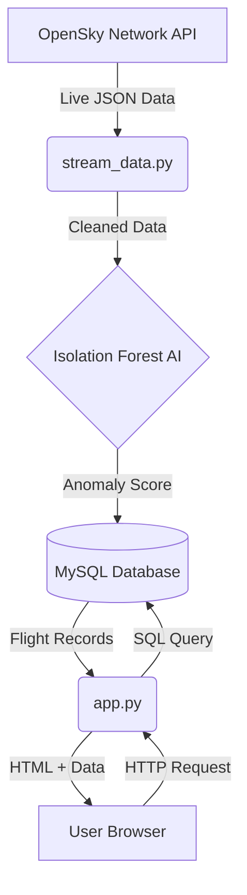

# 🦅 Flight Anomaly Detection: Master Project Guide

## 1. Project Overview
This project is a **Real-Time Security Command Center** for monitoring aircraft. It detects anomalies (unusual flight behaviors like low speed or high altitude delay) using Machine Learning and visualization.

### Core Philosophy
- **Real-Time**: Data moves from the sky to the screen in seconds.
- **Automated**: The AI judges every flight automatically.
- **Visual**: Operators see issues instantly via color-coded dashboards.

## 2. System Architecture
The system consists of three distinct "nodes" working in parallel:

1.  **The Sensor Node (`stream_data.py`)**:
    *   Acts as the input. It constantly pulls data from the real world.
    *   It owns the "Intelligence" (runs the AI model).
    *   It writes to the Database.

2.  **The Storage Node (MySQL)**:
    *   The single source of truth.
    *   Decouples the input (Python) from the output (Website). This means if the website crashes, the data collection keeps running.

3.  **The Display Node (`app.py` + `dashboard.html`)**:
    *   Reads from Storage.
    *   Visualizes the data for humans.

## 3. Technology Stack

### Backend (The Brains)
-   **Python 3.12**: The programming language.
-   **Flask**: A lightweight web framework to serve the website.
-   **Pandas**: High-performance data manipulation (used for preparing AI data).
-   **Scikit-Learn**: The Machine Learning library (Isolation Forest).
-   **MySQL Connector**: The driver to talk to the database.

### Frontend (The Face)
-   **HTML5**: The structural skeleton.
-   **CSS3 (Modern)**:
    *   **Variables**: For the Color Theme.
    *   **Grid/Flexbox**: For the responsive layout.
-   **JavaScript (Chart.js)**: For the live velocity graph.
-   **Jinja2**: The templating engine that injects Python data into HTML.

## 4. How the Data Flows
1.  **Ingestion**: `stream_data.py` wakes up every 10 seconds. It asks OpenSky: "Who is flying above London?".
2.  **Processing**: It gets a list of 10 planes. It calculates `delay_ratio` and `speed_per_min`.
3.  **Judgement**: The AI looks at these numbers. If `speed` is 100km/h at 30,000ft, it flags it as specific anomaly (-1).
4.  **Storage**: The flight info + the AI's opinion is saved to the `flights` table.
5.  **Visualization**: The user's browser auto-refreshes. `app.py` asks the DB for the top 50 flights.
6.  **Rendering**: The Dashboard paints the anomaly rows in **RED** and normal rows in **GREEN**.

## 5. Security & Performance Features
-   **SQL Injection Protection**: We use parameterized queries (`VALUES (%s, %s)`) to prevent hackers from destroying the DB.
-   **Robustness**: `stream_data.py` has error handling (`try/except`) so one bad API call doesn't crash the radar.
-   **Efficiency**: The Dashboard only loads the top 50 rows to keep the interface snappy.
